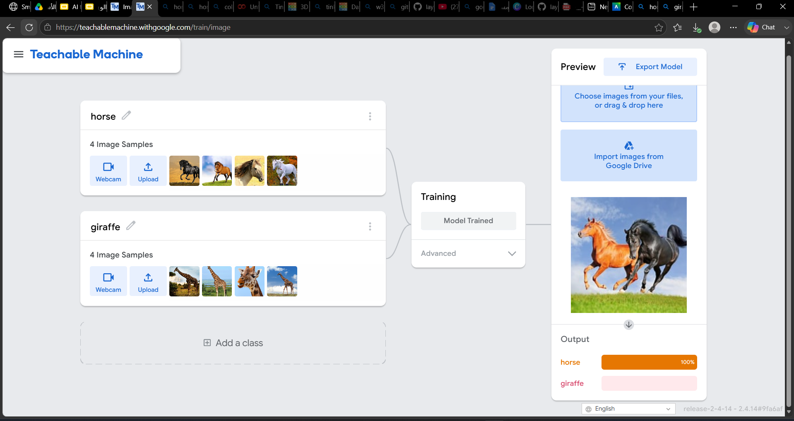
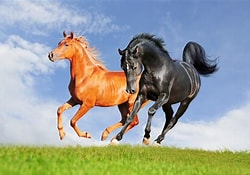
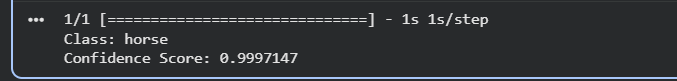

# AI-Image-Classification
# 🐎🦒 AI Image Classification

## Overview
This project uses Google's Teachable Machine to classify images into two categories:
- Horse
- Giraffe

The trained model was exported as a TensorFlow Keras model and tested using Python in Google Colab.

---

## Classes
- Horse
- Giraffe

---

## Model Training

The model was trained using Google's Teachable Machine.

### Teachable Machine Interface

---

## Test Image

The following image was used to test the trained model.

---

## Prediction Result

The model prediction after running the Python code.

---

## Repository Structure

